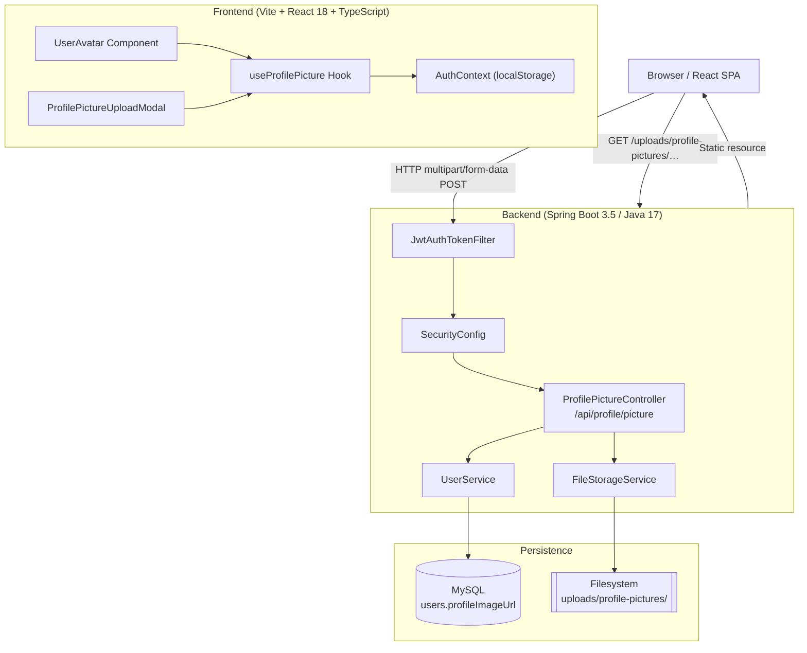
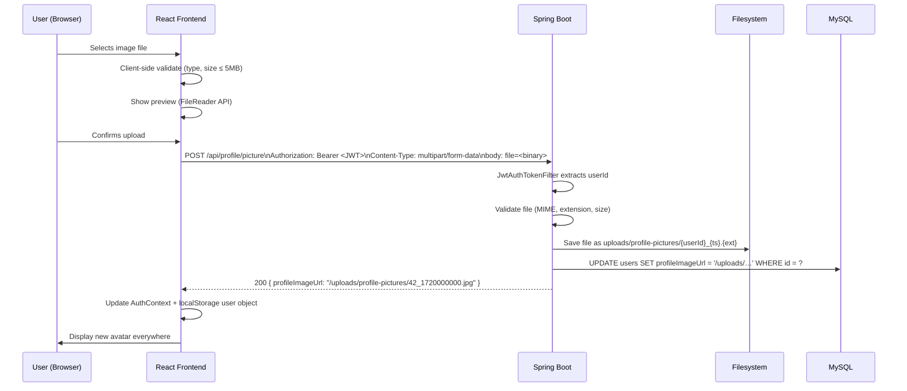
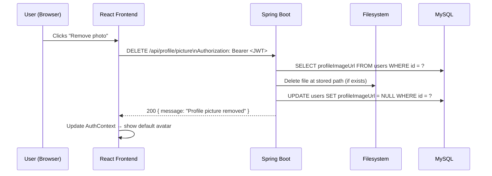
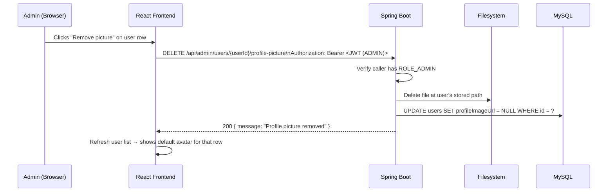
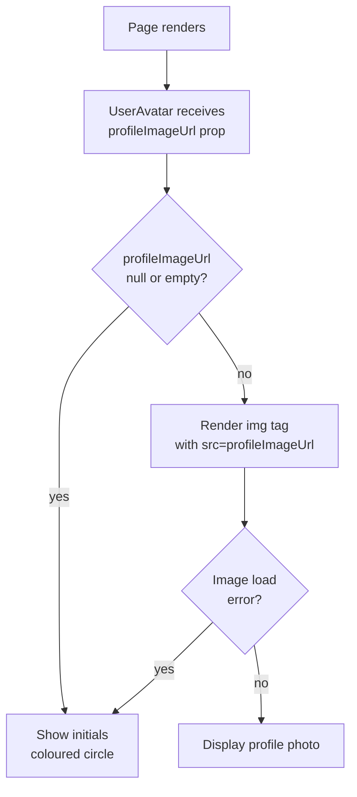
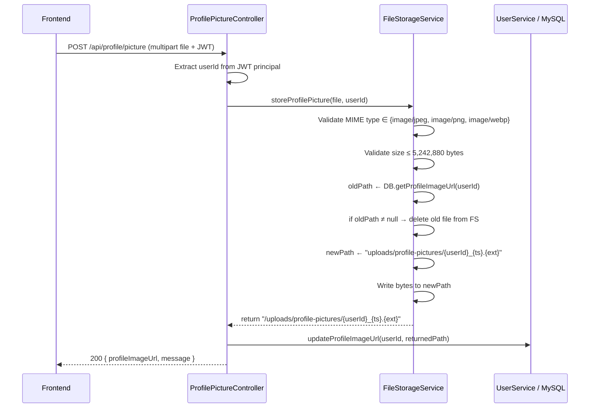

# Design Document: Profile Picture Upload

## Overview

This feature adds profile picture management to the Online Industrial Practical Training Logbook
Management System. Every authenticated user — Student, University Supervisor, Onsite Supervisor,
and Admin — can upload, change, remove, and display a personal profile picture. Images are served
back anywhere an avatar appears: the navbar, dashboard header, and profile section.

The system validates uploaded files on both the frontend and backend (accepted formats: JPG, JPEG,
PNG, WEBP; maximum size: 5 MB), stores the binary on the server filesystem, persists the URL path
in the `users` table, and serves the file through a dedicated static endpoint. A default avatar SVG
is shown when no image has been uploaded. Admins can view and remove any user's profile picture
through the existing user management interface.

The design aligns with the existing Spring Boot 3.5 + Java 17 + MySQL backend and the
React 18 + TypeScript + Vite + Tailwind + shadcn/ui frontend.

---

## Storage Strategy Decision: Filesystem vs. Base64-in-DB

### Recommendation: Server Filesystem + URL path in DB

| Criterion | Filesystem + URL | Base64 in DB |
|---|---|---|
| DB row size | Small (VARCHAR path only) | Very large (+33 % overhead per image) |
| Query performance | Unaffected | Every `SELECT * FROM users` transfers image bytes |
| Memory pressure | JVM heap unaffected | Large blobs loaded into heap on every user fetch |
| Serving speed | Nginx / Spring `Resource` streaming | Base64 decode + write on every request |
| Scalability | Easy to move to S3/CDN later | Re-architecture required |
| Backup simplicity | Filesystem + DB separate concerns | Images locked inside DB dump |

**Verdict**: Store image files under `uploads/profile-pictures/{userId}_{timestamp}.{ext}` on the
server filesystem and save only the relative URL path (`/uploads/profile-pictures/…`) in the
`profileImageUrl` column. This is consistent with how the existing `CheckIn` location photo
pattern works in similar Spring Boot projects and leaves a clean migration path to S3/CDN.

---

## Architecture



---

## Sequence Diagrams

### Upload Flow



### Delete Flow



### Admin Remove Flow



---

## Components and Interfaces

### Backend Components

#### ProfilePictureController

**Purpose**: REST endpoints for upload, retrieval, and deletion of profile pictures.

**Interface**:
```java
@RestController
@RequestMapping("/api/profile")
public class ProfilePictureController {

    // Upload or replace the caller's profile picture
    // POST /api/profile/picture
    // Requires: ROLE_STUDENT | ROLE_SUPERVISOR | ROLE_ADMIN
    ResponseEntity<?> uploadProfilePicture(
        @RequestParam("file") MultipartFile file,
        Authentication authentication
    );

    // Get the caller's current profile picture URL
    // GET /api/profile/picture
    ResponseEntity<?> getProfilePicture(Authentication authentication);

    // Remove the caller's profile picture
    // DELETE /api/profile/picture
    ResponseEntity<?> deleteProfilePicture(Authentication authentication);
}
```

**Responsibilities**:
- Delegate file validation to `FileStorageService`
- Delegate persistence to `UserService`
- Return `profileImageUrl` in responses so the frontend can update state immediately

#### FileStorageService

**Purpose**: Encapsulates all filesystem I/O; the rest of the system never touches the disk directly.

**Interface**:
```java
public interface FileStorageService {

    /**
     * Validates and saves the uploaded file.
     * @param file     The multipart upload
     * @param userId   Owner's user ID (used for unique file naming)
     * @return         The relative URL path to serve the file, e.g. "/uploads/profile-pictures/42_1720000000.jpg"
     * @throws InvalidFileException  if type or size validation fails
     * @throws StorageException      if the filesystem write fails
     */
    String storeProfilePicture(MultipartFile file, Long userId);

    /**
     * Deletes a profile picture file by its relative URL path.
     * Silently succeeds if the file does not exist.
     */
    void deleteProfilePicture(String relativePath);
}
```

**Responsibilities**:
- Validate MIME type against allowlist: `image/jpeg`, `image/png`, `image/webp`
- Validate file extension against allowlist: `jpg`, `jpeg`, `png`, `webp`
- Validate file size ≤ 5 MB (5,242,880 bytes)
- Generate collision-free filename: `{userId}_{System.currentTimeMillis()}.{ext}`
- Delete any previously stored file for the same user before saving the new one
- Create upload directory if it does not exist

#### UserService (additions)

```java
// Existing service — new methods added
void updateProfileImageUrl(Long userId, String profileImageUrl);
String getProfileImageUrl(Long userId);
```

#### AdminProfileController (additions to AdminController)

```java
// Admin-only: remove any user's profile picture
// DELETE /api/admin/users/{userId}/profile-picture
// Requires: ROLE_ADMIN
ResponseEntity<?> adminRemoveProfilePicture(
    @PathVariable Long userId,
    Authentication authentication
);
```

---

### Frontend Components

#### UserAvatar

**Purpose**: Renders a user avatar (profile picture or initials fallback) consistently across the app.

**Props**:
```typescript
interface UserAvatarProps {
  profileImageUrl?: string | null;
  firstName?: string;
  lastName?: string;
  size?: "sm" | "md" | "lg" | "xl";  // maps to 24/32/40/64 px
  onClick?: () => void;              // optional — opens upload modal
  className?: string;
}
```

**Responsibilities**:
- If `profileImageUrl` is set → render `` inside shadcn `<Avatar>`
- If no URL → render initials from `firstName`/`lastName` in a colored fallback circle
- Handle image load errors (broken URL) → fall back to initials

#### ProfilePictureUploadModal

**Purpose**: Dialog that lets a user preview, upload, change, or remove their profile picture.

**Props**:
```typescript
interface ProfilePictureUploadModalProps {
  open: boolean;
  onClose: () => void;
  currentImageUrl?: string | null;
  onSuccess: (newImageUrl: string | null) => void;
}
```

**Responsibilities**:
- Accept file via `<input type="file" accept=".jpg,.jpeg,.png,.webp">`
- Show preview using `FileReader.readAsDataURL()` before upload
- Client-side validation: reject unsupported types and files > 5 MB with toast error
- Call `POST /api/profile/picture` (upload) or `DELETE /api/profile/picture` (remove)
- Show progress indicator during upload
- Call `onSuccess` with new URL (or `null` on removal)

#### useProfilePicture (custom hook)

**Purpose**: Centralises API calls and shared state for profile picture operations.

```typescript
interface UseProfilePictureReturn {
  profileImageUrl: string | null;
  isUploading: boolean;
  upload: (file: File) => Promise<void>;
  remove: () => Promise<void>;
}

function useProfilePicture(): UseProfilePictureReturn;
```

---

## Data Models

### Backend: User Entity Changes

```java
// Addition to existing User.java
@Column(name = "profile_image_url", length = 512)
private String profileImageUrl;  // Nullable; stores relative URL path
```

**Validation rules**:
- Nullable (users without a picture get `null`)
- Max 512 characters (sufficient for any relative path)
- No default value — application logic falls back to default avatar on `null`

### Database Migration

```sql
-- V3__add_profile_image_url.sql  (Flyway migration or run manually)
ALTER TABLE users
    ADD COLUMN profile_image_url VARCHAR(512) NULL DEFAULT NULL
    COMMENT 'Relative URL path to stored profile picture file';
```

### DTO: ProfilePictureResponse

```java
public class ProfilePictureResponse {
    private String profileImageUrl;  // Nullable
    private String message;
}
```

### Frontend: Extended User type

```typescript
// Extends the existing User shape stored in localStorage
interface User {
  email: string;
  role: string;
  firstName: string;
  lastName: string;
  profileImageUrl?: string | null;  // NEW
}
```

### Upload Request (multipart/form-data)

```
POST /api/profile/picture
Content-Type: multipart/form-data

--boundary
Content-Disposition: form-data; name="file"; filename="photo.jpg"
Content-Type: image/jpeg

<binary image data>
--boundary--
```

---

## API Endpoint Design

### POST /api/profile/picture

Upload or replace the authenticated user's profile picture.

**Auth**: JWT required — any role  
**Content-Type**: `multipart/form-data`  
**Request field**: `file` (binary)

**Success Response** `200 OK`:
```json
{
  "profileImageUrl": "/uploads/profile-pictures/42_1720000000123.jpg",
  "message": "Profile picture updated successfully"
}
```

**Error Responses**:

| HTTP | Condition |
|---|---|
| `400 Bad Request` | No file provided, unsupported format, or file > 5 MB |
| `401 Unauthorized` | Missing or invalid JWT |
| `500 Internal Server Error` | Filesystem write failure |

---

### GET /api/profile/picture

Retrieve the authenticated user's current picture URL.

**Auth**: JWT required  
**Success Response** `200 OK`:
```json
{
  "profileImageUrl": "/uploads/profile-pictures/42_1720000000123.jpg"
}
```
Returns `{ "profileImageUrl": null }` when no picture is set.

---

### DELETE /api/profile/picture

Remove the authenticated user's profile picture and delete the file.

**Auth**: JWT required  
**Success Response** `200 OK`:
```json
{
  "profileImageUrl": null,
  "message": "Profile picture removed"
}
```

---

### DELETE /api/admin/users/{userId}/profile-picture

Admin removes any user's profile picture.

**Auth**: JWT required — `ROLE_ADMIN` only  
**Path param**: `userId` (Long)

**Success Response** `200 OK`:
```json
{
  "message": "Profile picture removed for user 42"
}
```

**Error Responses**:

| HTTP | Condition |
|---|---|
| `403 Forbidden` | Caller is not ROLE_ADMIN |
| `404 Not Found` | userId does not exist |

---

### GET /uploads/profile-pictures/{filename}

Serve the stored image file as a static resource.

**Auth**: Public (file paths contain opaque user ID + timestamp, not enumerable)  
**Response**: `image/jpeg` (or png/webp) binary stream  
**Configured via**: Spring Boot `WebMvcConfigurer` resource handler mapping
`/uploads/**` → `file:uploads/`

---

## Frontend Component Hierarchy

```
App.tsx
├── StudentDashboard.tsx
│   ├── [Header]
│   │   └── UserAvatar (size="md", onClick→ opens modal)  ← NEW
│   └── ProfilePictureUploadModal  ← NEW (conditionally rendered)
│
├── OnsiteSupervisorDashboard.tsx
│   ├── [Header]
│   │   └── UserAvatar  ← NEW
│   └── ProfilePictureUploadModal  ← NEW
│
├── UniversitySupervisorDashboard.tsx
│   ├── [Header]
│   │   └── UserAvatar  ← NEW
│   └── ProfilePictureUploadModal  ← NEW
│
└── AdminDashboard.tsx
    ├── [Header]
    │   └── UserAvatar  ← NEW
    ├── ProfilePictureUploadModal  ← NEW (for admin's own picture)
    └── [Users Tab / user rows]
        └── UserAvatar (size="sm", read-only display)  ← NEW
            └── [Remove Picture button per row]  ← NEW
```

**Shared components** (new, in `src/components/`):
- `UserAvatar.tsx`
- `ProfilePictureUploadModal.tsx`

**Shared hook** (new, in `src/hooks/`):
- `useProfilePicture.ts`

---

## Data Flow Diagrams

### Upload Data Flow

```mermaid
flowchart LR
    A[User selects file] --> B{Client-side\nvalidation}
    B -- invalid --> C[Toast error\nno request sent]
    B -- valid --> D[Show preview\nFileReader API]
    D --> E[User clicks Save]
    E --> F[POST /api/profile/picture\nMultipartFile + JWT]
    F --> G{Backend\nvalidation}
    G -- invalid --> H[400 Bad Request\ntoast error]
    G -- valid --> I[FileStorageService\nwrites file to FS]
    I --> J[UserService\nupdates DB URL]
    J --> K[200 OK\n{profileImageUrl}]
    K --> L[Frontend updates\nlocalStorage + AuthContext]
    L --> M[All UserAvatar\ncomponents re-render]
```

### Avatar Display Flow



---

## Security Considerations

### File Upload Attack Surface

| Threat | Mitigation |
|---|---|
| Polyglot files (e.g., JPEG with embedded script) | Validate MIME type from stream header using Apache Tika or Spring `Files.probeContentType`, not just extension |
| Path traversal via filename | Generate server-side filename; never use the client-supplied filename |
| Oversized uploads causing OOM | Enforce `spring.servlet.multipart.max-file-size=5MB` and `max-request-size=5MB` in `application.properties` |
| Serving uploaded files that contain malicious content | Serve from a path outside the web application root or set `Content-Disposition: attachment` |
| Enumeration of other users' pictures | Filenames contain only userId + timestamp; no user-accessible list endpoint; admin-only listing via existing `/api/admin/users` |
| Unauthorized upload for another user | JWT subject always maps to the authenticated user; upload endpoint only writes for the token owner |
| Admin spoofing | `@PreAuthorize("hasRole('ROLE_ADMIN')")` on admin removal endpoint |

### CORS

No changes needed — the existing `SecurityConfig` `CorsConfigurationSource` allows all origins and all methods, covering the new `POST` / `DELETE` profile picture endpoints.

### Static File Serving

```java
// WebConfig.java (new)
@Configuration
public class WebConfig implements WebMvcConfigurer {
    @Override
    public void addResourceHandlers(ResourceHandlerRegistry registry) {
        registry
            .addResourceHandler("/uploads/**")
            .addResourceLocations("file:uploads/")
            .setCacheControl(CacheControl.maxAge(7, TimeUnit.DAYS));
    }
}
```

Images are served with a 7-day `Cache-Control` header. Because filenames contain a timestamp component, changing a profile picture generates a new URL, so stale cache is never an issue.

---

## Error Handling

### Backend

| Scenario | HTTP Status | Response body |
|---|---|---|
| No file in request | 400 | `"No file provided"` |
| Unsupported format (e.g. .gif) | 400 | `"Unsupported file type. Allowed: JPG, JPEG, PNG, WEBP"` |
| File exceeds 5 MB | 400 | `"File size must not exceed 5 MB"` |
| Filesystem write error | 500 | `"Failed to store file. Please try again"` |
| User not found (admin remove) | 404 | `"User not found"` |
| Caller lacks ROLE_ADMIN (admin endpoint) | 403 | Spring Security default |

### Frontend

- Client-side validation fires before the network request; shows a `toast` (destructive variant) immediately.
- API errors show a destructive toast with the server error message.
- Image `onError` handler in `UserAvatar` silently falls back to the initials avatar — no visible broken-image icon.

---

## Testing Strategy

### Unit Testing

**Backend**:
- `FileStorageServiceTest`: assert accepted types pass, rejected types throw, oversized files throw, filename does not contain user-supplied characters.
- `ProfilePictureControllerTest` (MockMvc): upload happy path returns 200 with URL, missing file returns 400, wrong role returns 403 on admin endpoint.
- `UserServiceTest`: `updateProfileImageUrl` saves correctly, `getProfileImageUrl` returns null for new users.

**Frontend**:
- `UserAvatar.test.tsx`: renders image when URL provided, renders initials when null, falls back to initials on `onError`.
- `ProfilePictureUploadModal.test.tsx`: rejects files > 5 MB before network call, rejects `.gif`, accepts `.webp`.

### Property-Based Testing

**Property Test Library**: fast-check (frontend)

Properties to verify:
- For any valid image file (type ∈ {jpg, jpeg, png, webp}, size ≤ 5 MB), the upload call is made exactly once.
- For any invalid file type, no network request is made and a toast error is shown.
- `UserAvatar` always renders some visible content (image or initials) for any combination of `profileImageUrl`, `firstName`, `lastName`.

### Integration Testing

- End-to-end: upload a real JPG via `MockMvc` multipart request, assert the file exists on disk, assert `users.profile_image_url` is non-null in MySQL, then `GET /uploads/profile-pictures/{filename}` returns `200` with `Content-Type: image/jpeg`.
- Delete after upload: assert file is removed from disk and `profile_image_url` is `null` in DB.

---

## Performance Considerations

- Images are served as static files, bypassing the Spring MVC dispatcher chain — minimal latency.
- Profile picture column (`profile_image_url VARCHAR(512)`) adds only 512 bytes to the `users` table row maximum; joins and SELECT queries are unaffected.
- `Cache-Control: max-age=604800` (7 days) on the static resource handler means repeat visits cost zero round-trips for the image.
- The upload flow uses Spring's `MultipartFile` streaming — files are written directly to disk without buffering the entire payload in heap memory, keeping the JVM footprint small even at 5 MB uploads.

---

## Dependencies

### Backend

No new Maven dependencies required beyond what is already in the project:
- `spring-boot-starter-web` — `MultipartFile`, `ResourceHttpRequestHandler`
- `spring-boot-starter-security` — `@PreAuthorize`, `Authentication`
- `spring-data-jpa` / `hibernate` — `User` entity update
- `mysql-connector-j` — MySQL driver (already present)

Optional (recommended for deeper MIME validation):
```xml
<dependency>
    <groupId>org.apache.tika</groupId>
    <artifactId>tika-core</artifactId>
    <version>2.9.2</version>
</dependency>
```

### Frontend

No new npm packages required:
- `@radix-ui/react-avatar` — already present as `src/components/ui/avatar.tsx`
- `lucide-react` — `Upload`, `Trash2`, `Camera` icons (already installed)
- `@shadcn/ui` — `Dialog`, `Button`, `Avatar` (already present)

---

## Algorithmic Pseudocode

### Main Algorithm/Workflow



### Key Functions with Formal Specifications

#### storeProfilePicture

```java
String storeProfilePicture(MultipartFile file, Long userId)
```

**Preconditions**:
- `file` is non-null and `!file.isEmpty()`
- `userId` is a valid, existing user ID (≥ 1)
- The uploads directory exists or can be created

**Postconditions**:
- File is written to `uploads/profile-pictures/{userId}_{ts}.{ext}` on the local filesystem
- The returned string is the relative URL `/uploads/profile-pictures/{userId}_{ts}.{ext}`
- Any previously stored file for this `userId` has been deleted from disk
- If MIME or size validation fails, `InvalidFileException` is thrown and no file is written

**Loop Invariants**: N/A (no loops)

#### uploadProfilePicture (controller method)

```java
ResponseEntity<?> uploadProfilePicture(MultipartFile file, Authentication auth)
```

**Preconditions**:
- `auth` is non-null and authenticated (JWT filter guarantees this)
- `file` parameter present in request

**Postconditions**:
- On success: `users.profile_image_url` is updated for the authenticated user; response body contains new URL
- On validation failure: DB unchanged, file system unchanged, 400 returned
- On storage failure: DB unchanged (write to DB only happens after successful FS write)

**Loop Invariants**: N/A

#### Client-side validation (useProfilePicture hook)

```typescript
function validateFile(file: File): string | null
```

**Preconditions**:
- `file` is a browser `File` object

**Postconditions**:
- Returns `null` if file is valid (correct type AND size ≤ 5,242,880 bytes)
- Returns a non-empty error string if type is not in `["image/jpeg","image/png","image/webp"]`
- Returns a non-empty error string if `file.size > 5_242_880`
- Does NOT make any network request

---

## Correctness Properties

### Property 1: Upload Atomicity

If `storeProfilePicture` throws at any point, `updateProfileImageUrl` is never called — the database is never updated with a path to a non-existent file.

**Validates: Requirements 1.1**

### Property 2: Orphan-Free Storage

Before writing a new file, any existing file for the same `userId` is deleted. Over a user's lifetime, at most one profile picture file exists on disk per user.

**Validates: Requirements 1.2**

### Property 3: Type Safety

The MIME type check reads bytes from the stream header; it cannot be bypassed by renaming a `.gif` to `.jpg`.

**Validates: Requirements 2.1**

### Property 4: URL Integrity

The `profileImageUrl` stored in the DB always starts with `/uploads/profile-pictures/` and ends with one of `.jpg`, `.jpeg`, `.png`, `.webp` — or is `null`. It is never an external URL or an absolute filesystem path.

**Validates: Requirements 1.3**

### Property 5: Default Avatar Always Shown

`UserAvatar` guarantees a visible avatar for every rendered case — the `onError` handler and null guard ensure no broken-image state is ever shown to the user.

**Validates: Requirements 3.1**

### Property 6: Admin Isolation

The admin removal endpoint requires `ROLE_ADMIN` verified by `@PreAuthorize`. A student or supervisor JWT returns 403 without executing any business logic.

**Validates: Requirements 4.1**
